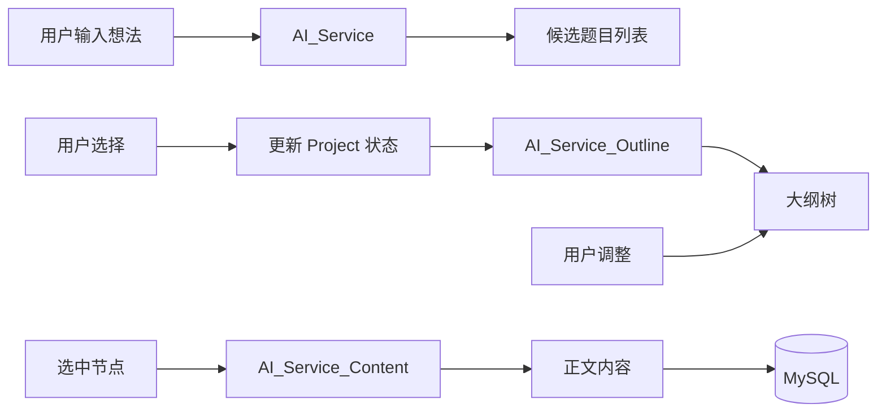

# DeepWrite 业务顶层设计

## 1. 业务全景图 (Business Overview)

DeepWrite 旨在提供一个“人机协作”的深度写作环境。系统的核心价值流是：**用户意图 -> AI 辅助发散 -> 人工确认/调整 -> AI 生成详情 -> 最终产物**。

整个写作流程被划分为四个线性的核心阶段：

### Phase 1: 选题策划 (Topic Selection)
- **目标**: 帮助用户从模糊的想法中提炼出具有学术价值的论文题目。
- **交互**:
    1. 用户输入领域/关键词（例如：“Java 虚拟线程性能分析”）。
    2. 系统调用 AI 分析该领域的当前热点，生成 3-5 个候选题目方案，每个方案包含：题目名称、核心摘要、预期难点。
    3. 用户选择一个心仪的题目，或者修改后确认。

### Phase 2: 大纲构建 (Outline Construction)
- **目标**: 确立论文的骨架结构，保证逻辑严密性。
- **交互**:
    1. 系统基于确认的题目，生成三级大纲树（章 -> 节 -> 小节）。
    2. 用户在 UI 上以思维导图或树形列表形式查看大纲。
    3. 支持操作：新增节点、删除节点、拖拽移动、让 AI 重写某章节标题。
    4. 用户点击“确认大纲”，锁定结构。

### Phase 3: 内容填充 (Content Generation)
- **目标**: 将骨架填充为血肉丰满的文章。
- **交互**:
    1. 用户选择某个大纲节点（例如“2.1 虚拟线程原理”）。
    2. 系统结合题目上下文、父级章节信息，调用 AI 生成该节点的正文草稿。
    3. 支持“润色模式”：用户选中一段文字，要求 AI “更学术化”、“扩写”或“精简”。

### Phase 4: 导出交付 (Export)
- **目标**: 生成符合格式要求的最终文档。
- **功能**: 将 Markdown 格式的结构化数据转换为 PDF 或 Word 文档下载。

---

## 2. 领域模型设计 (Domain Modeling)

系统采用领域驱动设计 (DDD) 的思想，核心领域对象如下：

### 2.1 核心实体 (Entities)

1.  **Project (写作项目)**
    *   **定义**: 用户的一次完整写作任务容器。
    *   **属性**: `id`, `userId`, `title`, `status` (CREATED, TOPIC_SELECTED, OUTLINE_FIXED, COMPLETED), `createdAt`.
    *   **作用**: 聚合根，管理整个生命周期。

2.  **TopicCandidate (候选题目)**
    *   **定义**: AI 生成的备选方案。
    *   **属性**: `projectId`, `title`, `abstract`, `innovationPoints` (创新点).

3.  **OutlineNode (大纲节点)**
    *   **定义**: 构成论文结构的树节点。
    *   **属性**: `id`, `projectId`, `parentId`, `title`, `order`, `level` (1, 2, 3).
    *   **关系**: 自关联树形结构。

4.  **SectionContent (章节内容)**
    *   **定义**: 具体的正文文本。
    *   **属性**: `nodeId`, `content` (Markdown), `version`, `lastModified`.

### 2.2 数据流转图 (Data Flow)

---

## 3. 核心状态机 (State Machine)

为了管理复杂的写作流程，系统维护一个严格的状态流转机制。

| 状态 | 描述 | 允许的操作 | 下一状态 |
| :--- | :--- | :--- | :--- |
| **INIT** | 项目初始化 | 生成题目 | TOPIC_GENERATED |
| **TOPIC_GENERATED** | 题目已生成，待选择 | 选择题目, 重新生成 | TOPIC_SELECTED |
| **TOPIC_SELECTED** | 题目已定，待生成大纲 | 生成大纲 | OUTLINE_GENERATED |
| **OUTLINE_GENERATED** | 大纲已生成，待调整 | 修改大纲, 确认大纲 | OUTLINE_CONFIRMED |
| **WRITING** | 正文写作中 | 生成内容, 润色 | COMPLETED |
| **COMPLETED** | 写作完成 | 导出, 修改 | - |

---

## 4. 关键技术策略

### 4.1 AI 服务交互
- **模型**: Google Gemini Pro (通过 Vertex AI 或 Studio API)。
- **协议**: 
    - 短文本（题目、大纲）：使用同步 HTTP 请求。
    - 长文本（正文）：前期使用同步等待，后期升级为 SSE (Server-Sent Events) 流式响应，提升用户体验。
- **Prompt 工程**: 将 Prompt 模板化管理，存储在代码或数据库中，便于调优。

### 4.2 数据存储
- **MySQL**: 存储结构化数据（Project, OutlineNode）。
- **Redis**: 存储临时会话数据、防重令牌、AI 响应缓存。

### 4.3 并发控制
- 对于同一个 Project，同一时间只允许一个 AI 生成任务在运行，防止上下文冲突。使用 Redis 分布式锁实现。
